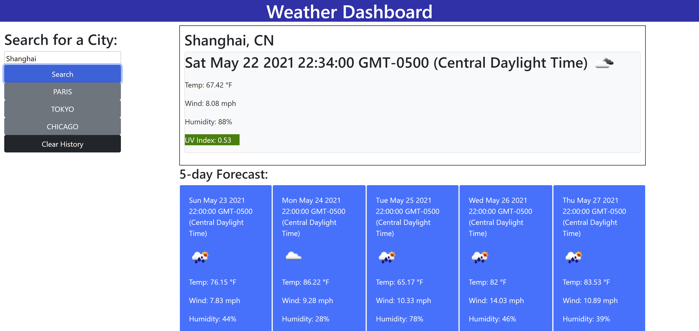

# weather-dashboard

## Description
This is a weather app that uses a free weather API to display current weather conditions, as well as a five day forcast for the city entered by the user. It also utilizes local storage to create buttons for previously searched cities. My motivation for creating this project was to get even more practice with API calls and manipulating data. This app gives users the ability to check the weather conditions anywhere in the world, and would be helpful for everyday use or if you're planning a trip! During this project I learned that the development process never ends (in a good way!). I will continue to work on this code and improve on it's functionality until I'm happy with it.

## Installation
You can download the repo for this app at (https://github.com/bwalters8910/weather-dashboard). Or you can visit the deployed app at (https://bwalters8910.github.io/weather-dashboard/).

## Usage
To use the app, just type a city into the search bar and click "submit". If you refresh the page, or revisting the page later, your past searches will be listed as buttons which can be clicked for ease of use.

## License
MIT License

Copyright (c) [year] [fullname]

Permission is hereby granted, free of charge, to any person obtaining a copy
of this software and associated documentation files (the "Software"), to deal
in the Software without restriction, including without limitation the rights
to use, copy, modify, merge, publish, distribute, sublicense, and/or sell
copies of the Software, and to permit persons to whom the Software is
furnished to do so, subject to the following conditions:

The above copyright notice and this permission notice shall be included in all
copies or substantial portions of the Software.

THE SOFTWARE IS PROVIDED "AS IS", WITHOUT WARRANTY OF ANY KIND, EXPRESS OR
IMPLIED, INCLUDING BUT NOT LIMITED TO THE WARRANTIES OF MERCHANTABILITY,
FITNESS FOR A PARTICULAR PURPOSE AND NONINFRINGEMENT. IN NO EVENT SHALL THE
AUTHORS OR COPYRIGHT HOLDERS BE LIABLE FOR ANY CLAIM, DAMAGES OR OTHER
LIABILITY, WHETHER IN AN ACTION OF CONTRACT, TORT OR OTHERWISE, ARISING FROM,
OUT OF OR IN CONNECTION WITH THE SOFTWARE OR THE USE OR OTHER DEALINGS IN THE
SOFTWARE.
